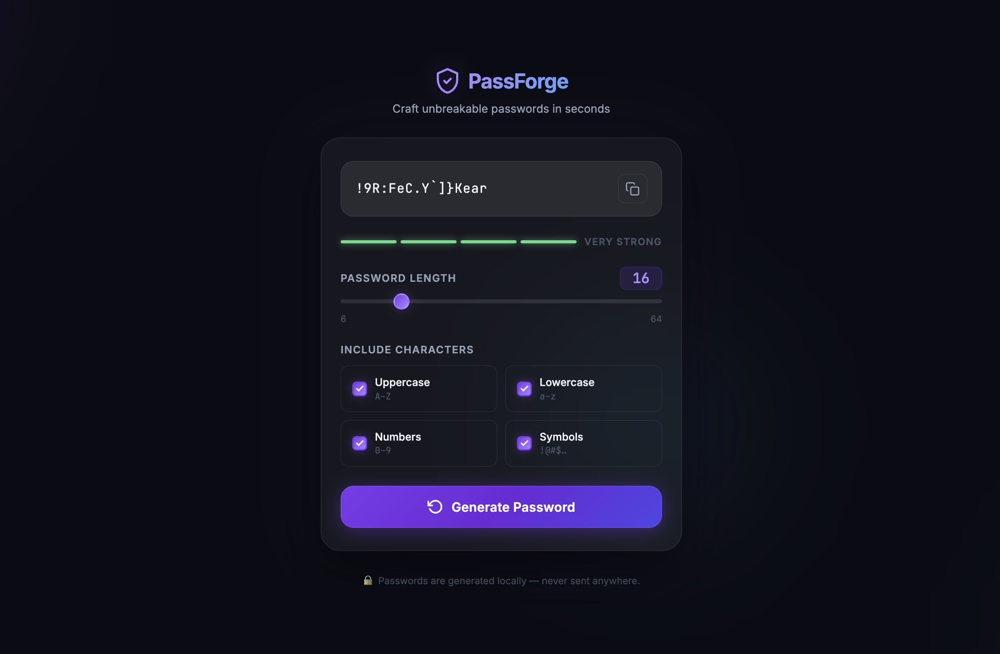

# 🔐 PassForge - Password Generator

A modern and minimal Password Generator web application to create strong, secure passwords instantly.  
Built with a sleek glassmorphism UI, smooth animations, and fully client-side logic — no data ever leaves your browser.

---

## 📸 Demo



---

## 🚀 Features

- 🎲 Generate cryptographically-shuffled random passwords  
- 📏 Adjustable password length from **6 to 64** characters  
- 🔠 Toggle **Uppercase**, **Lowercase**, **Numbers** & **Symbols** independently  
- 💪 Live **Password Strength Meter** (Very Weak → Very Strong)  
- 📋 One-click **Copy to Clipboard** with visual confirmation  
- 🌑 Animated glassmorphism dark UI with drifting background orbs  
- 🔒 100% client-side — passwords are **never sent anywhere**  

---

## 🛠️ Tech Stack

- HTML5  
- CSS3  

> No frameworks. No build tools. No dependencies.

---

## 📂 Project Structure

```
password-generator/
├── images/
│   ├── copy.png
│   └── generate.png
├── screenshots/
│   └── demo.png
├── index.html
├── style.css
└── README.md
```

---

## ⚙️ Getting Started

### 1. Clone the repository

```bash
git clone https://github.com/kaushtub001/password-generator.git
```

### 2. Navigate into the project

```bash
cd password-generator
```

### 3. Run the app

Open `index.html` in your browser — no build step required.

---

## 💡 Usage

- Drag the **length slider** to choose your desired password length  
- Check or uncheck character types to customize the character pool  
- Click **Generate Password** to create a new secure password  
- Click the **copy icon** to copy the password to your clipboard  
- Watch the **strength meter** update in real time as settings change  

---

## 💪 Strength Levels

| Level | Criteria |
|-------|----------|
| **Very Weak** | Very short or single character type |
| **Weak** | Short password with limited variety |
| **Fair** | Moderate length with some variety |
| **Strong** | Good length with 3+ character types |
| **Very Strong** | 16+ characters using all 4 character types |

---

## 🎨 UI Highlights

- **Glassmorphism card** with blur and subtle border glow  
- **Animated background orbs** in purple, blue, and cyan  
- **Custom range slider** with a gradient thumb and glow effect  
- **Custom checkboxes** with animated purple gradient fill  
- **Gradient generate button** with hover lift and icon spin  
- **Animated toast notification** on copy confirmation  
- **JetBrains Mono** monospace font for the password display  

